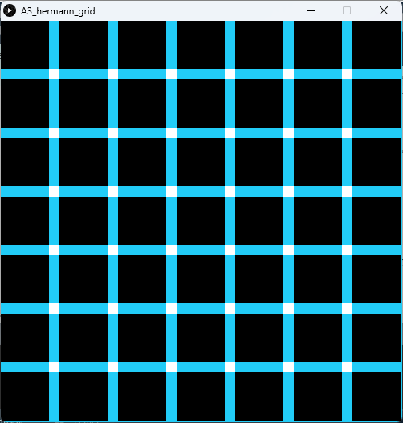

# processingExercises - My first Programming Exercises using Processing
After some basic steps using Scratch, our first programming language at school was [Processing](https://processing.org/). This is inspired by Java and provided the possibility to get nice results with low effort:
 
 

